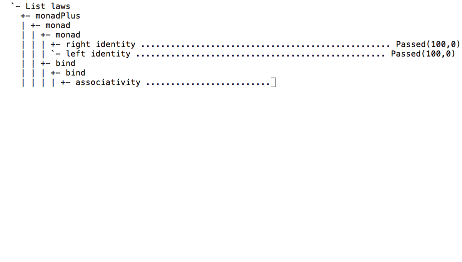
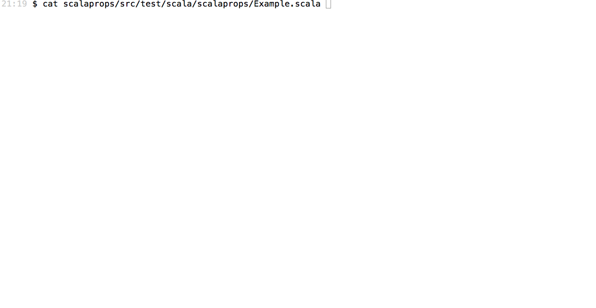

# scalaprops

[](https://www.scala-js.org)
[](https://javadoc-badge.appspot.com/com.github.scalaprops/scalaprops-all_2.12/scalaprops/index.html?javadocio=true)

property based testing library for Scala

### features
- real `scala.FunctionN` generators using [`Cogen`](gen/src/main/scala/scalaprops/Cogen.scala) (aka [CoArbitrary](https://hackage.haskell.org/package/QuickCheck-2.8.1/docs/Test-QuickCheck-Arbitrary.html#t:CoArbitrary) in QuickCheck). scalaprops can generate not only constant Functions
- flexible parameter settings for each test( [ScalaCheck doesn't have this feature](https://github.com/typelevel/scalacheck/issues/120) )
- timeout as soon as possible
- flexible law checking like [discipline](https://github.com/typelevel/discipline)
 - discipline uses only `String` for test id. but scalaprops can use other than `String`
- scalaz integration
 - laws for scalaz typeclasses
 - [`Gen`](gen/src/main/scala/scalaprops/Gen.scala) and [`Cogen`](gen/src/main/scala/scalaprops/Cogen.scala) instances of scalaz datatypes
- immutable random number generator
 - scalaprops does not use `scala.util.Random` because `scala.util.Random` is mutable
 - default implementation is [Mersenne Twister](http://www.math.sci.hiroshima-u.ac.jp/~m-mat/MT/emt.html) (JVM, scala-native) or [Tiny Mersenne Twister](http://www.math.sci.hiroshima-u.ac.jp/~m-mat/MT/TINYMT/) (Scala.js)
- [Scala.js](https://www.scala-js.org/) support
- [scala-native](http://scala-native.org) support. see <https://github.com/scalaprops/scalaprops-native-example>
- [deterministic testing](#deterministic-testing)

### latest stable version

[please use sbt plugin because there are some convenient features.](https://github.com/scalaprops/sbt-scalaprops)


<details><summary>setup without sbt plugin</summary>

```scala
testFrameworks += new TestFramework("scalaprops.ScalapropsFramework")

parallelExecution in Test := false // currently, does not support parallel execution

libraryDependencies += "com.github.scalaprops" %% "scalaprops" % "0.8.0" % "test"
```

```scala
libraryDependencies += "com.github.scalaprops" %% "scalaprops-scalaz" % "0.8.0" % "test"
```

</details>


- [API Documentation](https://oss.sonatype.org/service/local/repositories/releases/archive/com/github/scalaprops/scalaprops-all_2.12/0.8.0/scalaprops-all_2.12-0.8.0-javadoc.jar/!/scalaprops/index.html)
- [sxr](https://oss.sonatype.org/service/local/repositories/releases/archive/com/github/scalaprops/scalaprops-all_2.12/0.8.0/scalaprops-all_2.12-0.8.0-sxr.jar/!/index.html)




### deterministic testing

Scalaprops emitting which seed it started with during a failing test, and providing an interface `--seed=<value>` for re-running the failing test with the same seed.



### examples
See [scalaprops-example](https://github.com/scalaprops/scalaprops-examples) project.

### for scalaz 7.1.x

<https://github.com/scalaprops/scalaprops/tree/0.1.x>
